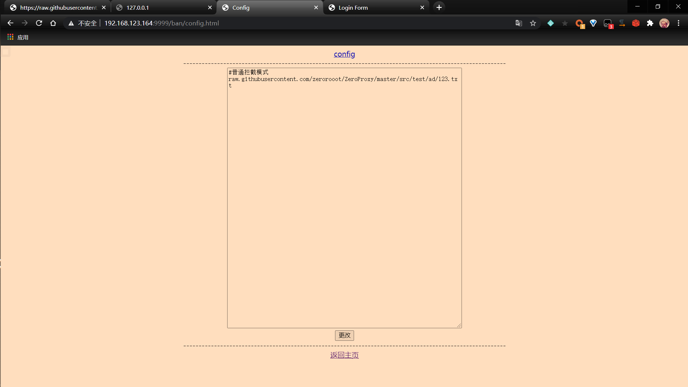
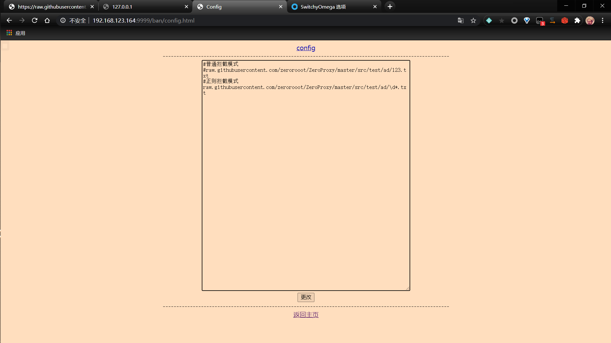

# ZeroProxy

ZeroProxy是一个在[proxyee](https://github.com/monkeyWie/proxyee)基础上开发的，用于拦截请求以及修改返回的json的HTTP 代理服务器。

# 前言

最近迷上了去广告，总所周知，在pc的chrome上，安装 Adblock Plus 即可简单的完成去广告的操作，但是在手机上，就非常的麻烦。

笔者研究了几款在手机的去广告的app，发现大都是通过建立vpn连接，来拦截相关请求，从而达到去广告的目的。

缺点也非常的明显，首先，耗电；其次，为什么不用hosts来拦截呢？效果也是一样的；还有，不能拦截https类的广告；最后，对于返回的json里的广告也不能拦截。

在没写出这个应用之前，笔者使用树莓派，安装 privoxy+privoxy2adblock，进行广告拦截。在使用的过程中，笔者发现可以使用privoxy的定向功能，对广告进行自定义的拦截。比如，我不想更新某应用，但它每次使用都会弹窗提醒我，非常的麻烦。对其抓包，编写actionsfile规则，拦截更新请求。这样，每次打开的时候非常的清净。

但好景不长，当我尝试使用这个方法去https类的广告时，不起作用。因为https有加密，不能获取请求的网址，只能获取请求的域名。如果是广告类的域名，直接屏蔽即可。可如果不是呢？如，某广告请求是“https://www.google.com/ad.html",难道我要屏蔽这个google吗？

所以就诞生了此应用，运行在服务器上，通过代理的方式，中间人攻击，获取请求的网址以及返回的数据。屏蔽广告网址，删除返回json里的广告内容。岂不美哉？

# 使用

## 下载&编译

安装[maven](https://maven.apache.org/download.cgi)

```bash
git clone git@github.com:zerorooot/ZeroProxy.git
cd ZeroProxy
mvn assembly:assembly
```

这样，就在target目录下生成了我们需要的ZeroProxy-1.0-jar-with-dependencies.jar文件。

## 安装证书

下载项目中的src/resources/ca.crt，导入到正确位置。如何导入还请自行搜索

```
注：Android 7以及以上，系统不再信任用户安装的证书，你需要root后，下载src/test/913718f3.0，然后把文件移动到
/system/etc/security/cacerts/
并给与644权限,然后重启即可
```

## 运行

```bash
java -jar target/ZeroProxy-1.0-jar-with-dependencies.jar ip port configFile account password
```

### ip

指你的ip地址，为了分享给其他设备使用，这里建议使用内网地址，如 192.168.123.164

### port

指ZeroProxy运行的端口，如 9999

### configFile

用于存放配置文件的文件夹，要求绝对目录，如 D:\JavaCode\ZeroProxy\src\test

### account&password

网页端的账号和密码，这两项不是必要的，不填的话，默认关闭网页控制。

### 示例

```bas
java -jar target\ZeroProxy-1.0-jar-with-dependencies.jar 192.168.123.164 9999 D:\JavaCode\ZeroProxy\src\test admin 123456
```

## 设置代理

### window

设置--》网络和internet--》代理--》手动设置代理--》使用代理服务器其中，地址就是你设置的ip地址，端口就是你设置的端口。在本例子中，地址是192.168.123.164，端口是9999

或

在chrome中下载[SwitchyOmega](chrome-extension://padekgcemlokbadohgkifijomclgjgif/options.html#!/about)，设置代理协议为http，代理服务器以及代理端口均为你输入的的。

### android

设置--》wlan和互联网--》wlan--》点击你目前使用的wifi--》点击右上角的“✏”--》高级选项--》代理--》手动--》代理服务器主机名为你设置的IP，代理服务器端口为你设置的端口--》保存

### ios

设置--》无线局域网络--》点击你目前使用的wifi--》最下面，http代理--》手动--》服务器为你设置的IP，端口为你设置的端口--》储存

# 注：必须安装好证书，不然没发使用！！！

# 配置文件

好了，现在程序已经运行起来了，但还不能去广告，因为我们没有配置相关内容

由于我们开启了网页控制，所以直接进入 http://ip:port/index.html配置即可。

如果你没有开启网页界面，请在configFile下的config.txt里进行配置

## 处理网址

对所有的网址都要进行处理，不然无法得到你想要的结果。

需要删除开头的https://,以及后面的参数（“？”以及“？”后的内容）。

### 例

假设，通过抓包，找到了此网址为广告地址

```
https://raw.githubusercontent.com/zerorooot/ZeroProxy/master/src/test/ad/123.txt?signal=12fsaw34567&time=8765431352
```

**删除**网址前面的 

```
https://
```

和网址“?”以及后面的内容

```
?signal=12fsaw34567&time=8765431352
```

把

```
raw.githubusercontent.com/zerorooot/ZeroProxy/master/src/test/ad/123.txt
```

输入到配置文件里

## 拦截请求

### 普通拦截

把

```
raw.githubusercontent.com/zerorooot/ZeroProxy/master/src/test/ad/123.txt
```

输入到文本框里，并点击更改。

最终效果是这样的👇



然后，再次进入，https://raw.githubusercontent.com/zerorooot/ZeroProxy/master/src/test/ad/123.txt?signal=12fsaw34567&time=8765431352，我们发现，网址被重定向到了127.0.0.1，成功实现了网址拦截

### 正则拦截

但要是每次请求的网址都有变呢？难道要把所有的网址都存下来吗？明显不现实。

注释“raw.githubusercontent.com/zerorooot/ZeroProxy/master/src/test/ad/123.txt”

新加一条

```
raw.githubusercontent.com/zerorooot/ZeroProxy/master/src/test/ad/\d*.txt
```

输入到文本框里，并点击更改。

最终效果是这样的👇



进入“https://raw.githubusercontent.com/zerorooot/ZeroProxy/master/src/test/ad/345.txt”和“https://raw.githubusercontent.com/zerorooot/ZeroProxy/master/src/test/ad/123.txt”，发现均被拦截。

### 检测书写规则是否奏效

由于正则可能存在转义等一堆问题，难道要没次都傻傻的进入被拦截的网址测试吗？明显太蠢了。

点击最下方的<u>返回主页</u>

在最上面，看到要测试的url。输入

```
https://raw.githubusercontent.com/zerorooot/ZeroProxy/master/src/test/ad/345.txt
```

返回的是true，证明我们书写的正则奏效了。

### 注

拦截请求这么配置就ok了。注意的是，对于某广告网址，需要先删除开头的https://,以及后面的参数（“？”以及“？”后的内容）。

## 更改返回的json

### 替换模式


### 删除模式


# UBG

在开启网页控制的情况下，某些时候会不返回数据，原因未知。如无必要，还请关闭网页控制。